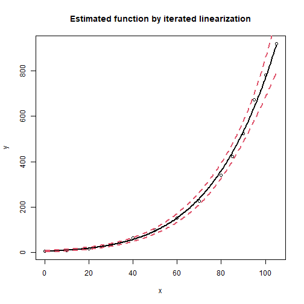
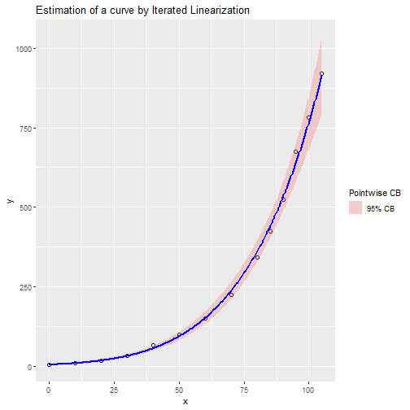

# OEFPIL


## Optimal Estimation of Parameters by Iterated Linearization

The original version of this software was written in R by Stanislav Zámečník, Zdeňka Geršlová and Vojtěch Šindlář in year 2021. The package is based on theoretical background of work of prof. Gejza Wimmer and afterwards implemented by mentioned authors. 
Main features of package include:

- estimation of parameters of nonlinear function by iterated linearization
- possibility to use generic functions to OEFPIL objects
  - extract confidence bands for set of points
  - confidence intervals for parameters 
  - extract summary of used model
  - get covariance matrix for model parameters
- plot the OEFPIL object in the following ways
  - plot of estimated curve 
  - plot of estimated curve with ggplot2 package
  - plot of parameters with error bars with ggplot2 package
- count orthogonal residuals for OEFPIL object
- print out information about OEFPIL object
- calculate estimates of parameters in Nanoindentation
- two datasets were added to the package to show functionality

## Installation

You can install release from GitHub repository by:

``` r
devtools::install_github("stazam/OEFPIL-")
``` 
or you install this release from [CRAN](https://CRAN.R-project.org) with: 

``` r
install.packages("OEFPIL")
``` 

## Usage

In R session do:


```r
library(MASS)
steamdata <- steam
colnames(steamdata) <- c("x","y")
k <- nrow(steamdata)
CM <- diag(rep(5,2*k))
```

Creating OEFPIL object which we want to work with


```r
library(OEFPIL)
st1 <- OEFPIL(steamdata, y ~ b1 * 10 ^ (b2 * x/ (b3 + x)),
list(b1 = 5, b2 = 8, b3 = 200), CM, useNLS = FALSE)
```

Displaying results using summary function

```r
summary(st1)
```

```
## Summary of the result:  
##  
## y ~ b1 * 10^(b2 * x/(b3 + x))
## 
##     Param Est         Std Dev   CI Bound 2.5 %   CI Bound 97.5 %
## b1   4.487870        1.079683         2.371730          6.604011
## b2   7.188155        1.319428         4.602123          9.774186
## b3 221.837783       70.677909        83.311627        360.363940
## 
##  Estimated covariance matrix: 
##           b1        b2         b3
## b1  1.165716  1.148097   67.15270
## b2  1.148097  1.740891   92.31566
## b3 67.152702 92.315659 4995.36683
## 
##  Number of iterations: 10
```

Plot of estimated function

```r
plot(st1, signif.level = 0.05, interval = "conf", main  = "Estimated function by iterated linearization")
```



Ggplot graph of estimated function 

```r
library(ggplot2)
curvplot.OEFPIL(st1, signif.level = 0.05)
```



For more information and examples see:

```r
?OEFPIL
```


